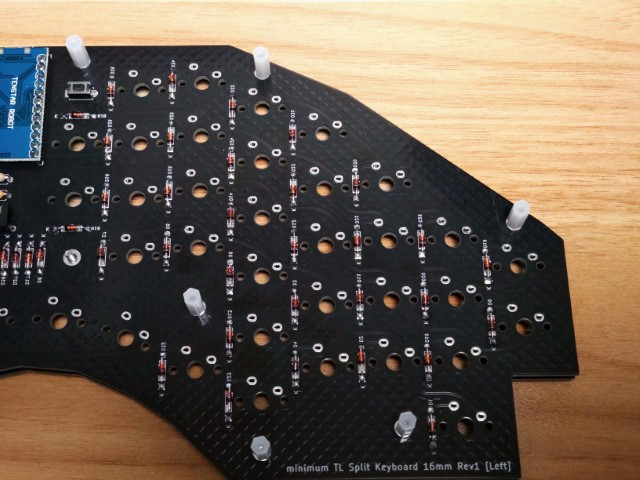
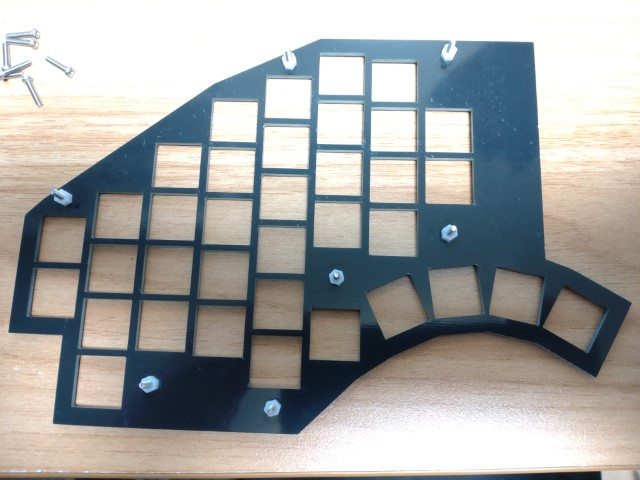
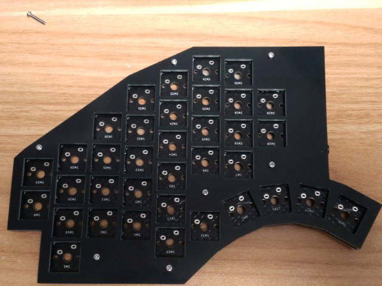
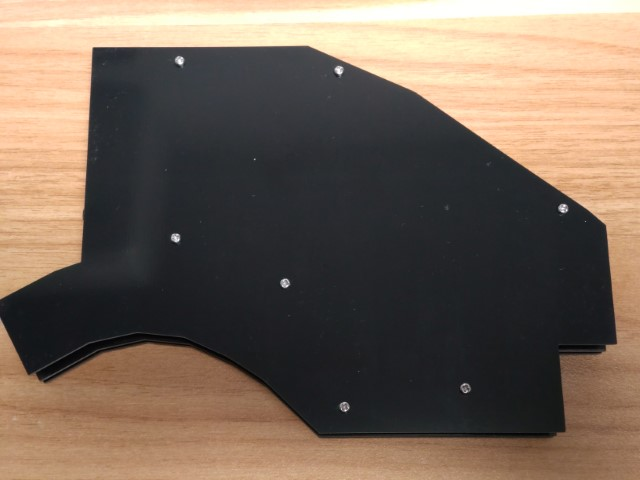

# minimum TL Split Keyboard 16mm Rev1ビルドガイド

minimum TL Split Keyboard 16mm Rev1は、TRON最小化配列のキーボードです。
TRON最小化配列の16mmピッチを、Cherry MXキーで実現しています。

## 説明
minimum TL Split Keyboard 16mm Rev1は、PCBが左右違います。4.7kΩ抵抗（R1,R2）がある方が左です。
基本的に、左側にUSBケーブルを接続するようにしています。

PCBには、表面と裏面があります。"minimum TL Split Keyboard"と記載がある方が、裏面です。

## 組み立て
### PCBへパーツ半田付け

- ダイオードを、左右PCB裏面に36カ所実装します。

ダイオードを、左右PCB裏面に実装します。ダイオードは極性があるので、カソード（黒い方）をシルク印刷で線が入っている方（かつKと書かれて、穴が四角の方）になるよう、左右それぞれ36カ所半田付けしていきます。

- 4.7kΩ抵抗を左側PCB表面に2カ所実装します。

4.7kΩ抵抗を、左側PCB表面のみに実装します。極性は無いので、どちらでもかまいません。

- リセットスイッチを、左右PCB裏面に実装します。

リセットスイッチを、左右PCB裏面に実装します。左右PCBそれぞれに1カ所ずつリセットスイッチ位置があるので、半田付けしてください。

※裏面にシルク印刷されています。

- TRRSジャックを、左右PCB裏面に実装します。

TRRSジャックを、左右PCB裏面に実装します。左右PCBに、それぞれ半田付けしてください。

※裏面にシルク印刷されています。

### Pro Microへコンスルー半田付け

遊舎工房で購入すれば、コンスルー付きが買えます。

PCBから外した状態で、部品（USBコネクタなど）が実装されている面にコンスルーを載せて、半田付けします。

できたら、左右PCBの裏面にはめ込みます。基板の外側（左側は左、右側は右）にUSBコネクタが来るようにはめます。

### CherryMX キースイッチ半田付け

トッププレートとPCBの間に短い方のスペーサー(3mm)をはさみ、左右それぞれ7カ所を長い方のねじ（10mm）でネジ止めします。ねじ頭が上側に来るようにして、PCBの下には長い方のスペーサー(10mm)で止めてください。
キースイッチをトッププレートの上からトッププレート・PCBにはめ込み、固定します。ここでキーが浮かないよう、しっかりトッププレートにはめ込んで、半田付けしてください。

CherryMXキースイッチは、親指扇形部分含め72カ所半田付けします。

※注意点:親指キー部分は、キースイッチによっては干渉してしまう場合があります。その場合、干渉するキーの出っ張り部分をニッパ等で切り落としてください。

## ProMicroにファームウェア書き込み
[QMK Toolbox](https://github.com/qmk/qmk_toolbox) で、ファームウェア（hexファイル）をProMicroに書き込む必要があります。

[QMK Toolbox](https://github.com/qmk/qmk_toolbox) のインストール・使い方については、サリチル酸さんが書かれた[（初心者編）自作キーボードにファームウェアを書き込む](https://salicylic-acid3.hatenablog.com/entry/qmk-toolbox) が分かりやすいです。

minimum TL Split Keyboardのファームウエアは、 [satromi_mintlsplit_default.hex](https://github.com/satromi/minimumtlsplit16_rev1/blob/main/hex/satromi_mintlsplit_default.hex) をダウンロードしてQMK Toolboxで書き込みます。

ファームウェアは、左右のProMicroそれぞれに書き込む必要があります。

他のキーマップに変更したい場合は、VIA対応ファームウェアも準備しています。[satromi_mintlsplit_via.hex](https://github.com/satromi/minimumtlsplit16_rev1/blob/main/hex/satromi_mintlsplit_via.hex) をダウンロードして、QMK Toolboxで書き込みます。

Dvorak配列のファームも公開しています。[satromi_mintlsplit_dvorak.hex](https://github.com/satromi/minimumtlsplit16_rev1/blob/main/hex/satromi_mintlsplit_dvorak.hex) をダウンロードして、QMK Toolboxで書き込みます。

VIA対応ファームウェアの場合、Webサイトからキーマップを変更できる [REMAP](https://remap-keys.app/)  も利用できます。
[REMAPのminimum TL Split Keyboardページ](https://remap-keys.app/catalog/AqZy7RsTgu0kxObJxxYr)  から書き換えてみてください。

## 動作確認

左右のキーボードをTRRSケーブルで繋いだら、USBケーブルでPCと接続し、動作確認してください。

## ボトムケース取り付け

動作確認して問題なければ、ボトムプレートを取り付けます。左右それぞれ7カ所を短い方のねじ（6mm）でネジ止めします。ねじ頭が下側（ボトムケース側）に来るようにしてください。

最後に、クッションゴムを取り付けます。左右それぞれ6カ所貼り付けます。お好きな位置に取り付けてください。
